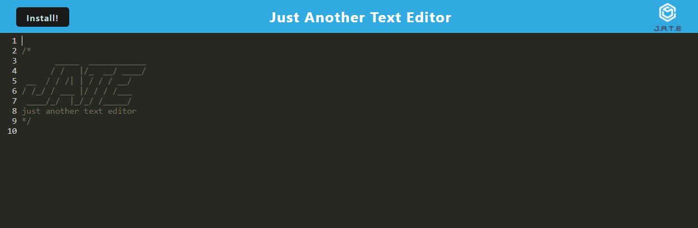

# pwa-text-editor - 
A simple text editor that allows the user to create notes or code snippets with or without an internet connection that can be reliably retrieved at a later time

## **Description**
`JATE` is just another text editor that meets Progressive Web Applications (PWA) criteria. It features data persistence techniques in the event that one of the options are not supported by the user's browser. It is also designed to function offline.

Deployed Application: [J.A.T.E.](https://pwa-jate-cc.herokuapp.com/)

## **Table of Contents**

- [Installation](#installation)
- [Usage](#usage)
- [License](#license)
- [Technology](#technology)
- [Questions](#questions)

## **Installation**

To install this application, make a `clone` of this repository to your local machine. Open the repository in your code editor of choice 🖥️ 

## **Usage**

Once the repository is cloned to your local machine, then:

Option 1 - Launch from the Terminal:
- Install the required packages by running `npm i` or `npm install` in your applicable terminal
- Run `npm run start` in the terminal
- Open `http://localhost:3000` in your browser

## **License**

MIT License

Copyright &copy; 2022 Cheryl Caitano

Permission is hereby granted, free of charge, to any person obtaining a copy
of this software and associated documentation files (the "Software"), to deal
in the Software without restriction, including without limitation the rights
to use, copy, modify, merge, publish, distribute, sublicense, and/or sell
copies of the Software, and to permit persons to whom the Software is
furnished to do so, subject to the following conditions:

The above copyright notice and this permission notice shall be included in all
copies or substantial portions of the Software.

THE SOFTWARE IS PROVIDED "AS IS", WITHOUT WARRANTY OF ANY KIND, EXPRESS OR
IMPLIED, INCLUDING BUT NOT LIMITED TO THE WARRANTIES OF MERCHANTABILITY,
FITNESS FOR A PARTICULAR PURPOSE AND NONINFRINGEMENT. IN NO EVENT SHALL THE
AUTHORS OR COPYRIGHT HOLDERS BE LIABLE FOR ANY CLAIM, DAMAGES OR OTHER
LIABILITY, WHETHER IN AN ACTION OF CONTRACT, TORT OR OTHERWISE, ARISING FROM,
OUT OF OR IN CONNECTION WITH THE SOFTWARE OR THE USE OR OTHER DEALINGS IN THE
SOFTWARE.

## **Technology**

- [JavaScript](https://www.javascript.com/) Scripting Language
- [Node](https://nodejs.org/en/) JavaScript Runtime
- [npm](https://www.npmjs.com/) Multiple Packages
- [Heroku](https://www.heroku.com/) Heroku Delivery Platform
## **Questions**

For any questions or contributions please contact me on Github or by e-mail:

[Github Profile](https://www.github.com/ccaitano)  
[Email Me](mailto:cheryl.caitano@gmail.com)
